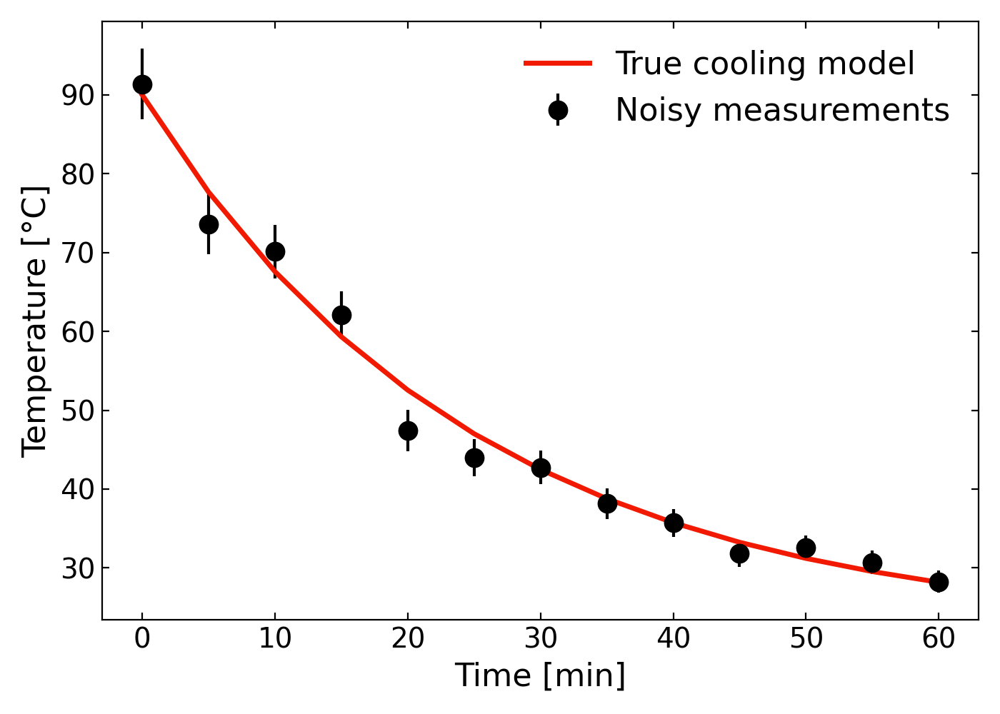
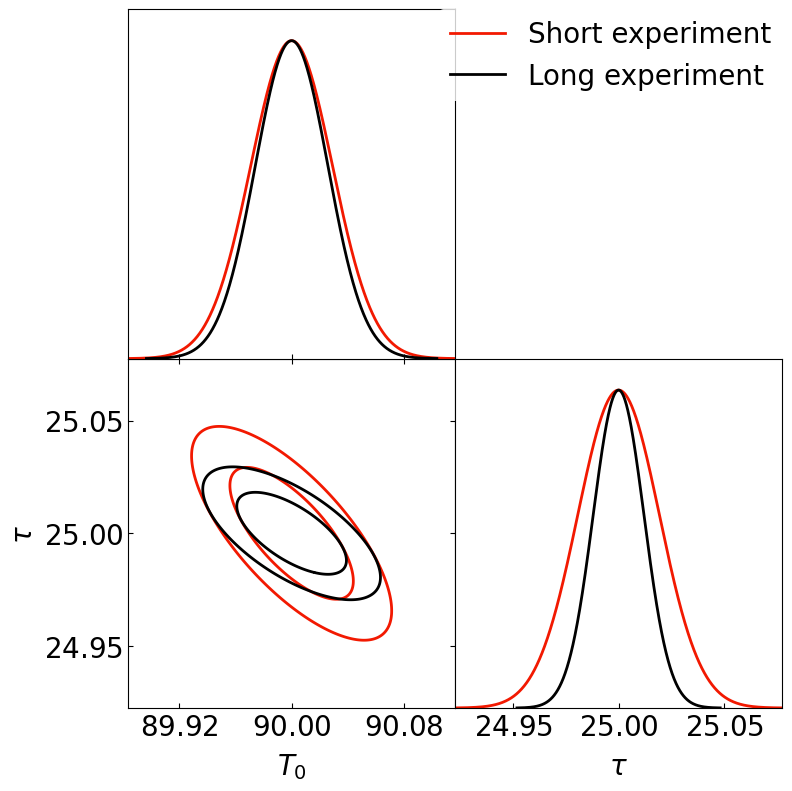
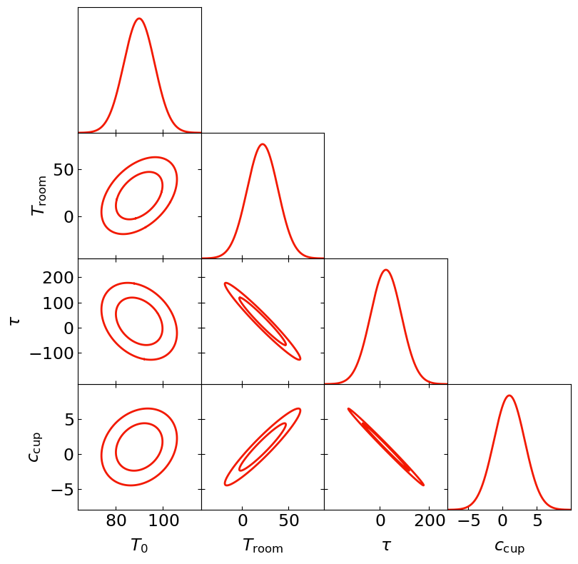

#  Fish in the Percolator
<p align="center">
  🐟 · ☕ · 📈
</p>


<p align="center">
  
</p>

*A simple Fisher forecasting demonstration using coffee cooling and [DerivKit](https://docs.derivkit.org/main/index.html).*

## Table of contents

* [Motivation](#motivation)
* [The model](#the-model)
* [Synthetic observations](#synthetic-observations)
* [Fisher forecasting](#fisher-forecasting)
* [Why derivatives?](#why-derivatives)
* [Why coffee?](#why-coffee)
* [Running the demo](#running-the-demo)
* [Interpreting the results](#interpreting-the-results)
  * [Cooling curve](#cooling-curve)
  * [Two-parameter forecast](#two-parameter-forecast)
  * [Triangle plot](#triangle-plot)
* [Beyond this toy model](#beyond-this-toy-model)
* [Repository structure](#repository-structure)
* [License and media credit](#license-and-media-credit)

---

## Motivation

Many scientific problems involve predicting how well model parameters could be constrained by noisy data.

Suppose we repeatedly measure the temperature of a cup of coffee as it cools.
Before fitting any particular data set, we may want to ask forecasting questions such as

* If the true initial coffee temperature is near a fiducial value, how accurately could we estimate it?
* If the true cooling time is near a fiducial value, how accurately could we estimate it?
* If we had a mroe advanced model, which parameters would be most strongly correlated?
* How would the forecasted uncertainties change if we collected more measurements?
* How would the forecasted uncertainties change if the measurements were noisier or more precise?

Here, **fiducial** means the parameter values that we assume to be true when building the forecast.

These are exactly the kinds of questions addressed by **[Fisher forecasting](https://en.wikipedia.org/wiki/Fisher_information)**.

This repository provides a small demonstration of Fisher forecasting using **[Newton's law of cooling](https://en.wikipedia.org/wiki/Newton%27s_law_of_cooling)**, with forecasts computed using **DerivKit**.

Although the example is intentionally simple, the same workflow scales to much larger scientific models with many parameters.

---

## The model

We describe the temperature of the coffee using Newton's law of cooling

$$
T(t)=T_{\rm room}+\left(T_0-T_{\rm room}\right)e^{-t/\tau}
$$

where

* $T_0$ is the initial coffee temperature,
* $T_{\rm room}$ is the ambient room temperature,
* $\tau$ is the cooling time,
* $t$ is the elapsed time.

The temperature approaches the room temperature exponentially.

In the simplest example we forecast constraints on two parameters

$$
\theta=(T_0,\tau)
$$

while keeping the room temperature fixed.

Later we introduce additional nuisance parameters to illustrate larger Fisher forecasts and triangle plots.

### Advanced model

The simplest model forecasts only the initial coffee temperature and cooling time,

$$
\theta = (T_0, \tau).
$$

To make the example closer to a realistic Fisher forecast, the full demo also includes an advanced model with more parameters.

In this model, the temperature is still based on exponential cooling, but we allow additional parameters to vary. This creates a larger parameter vector and therefore a larger Fisher matrix.

The purpose of the advanced model is not to make coffee cooling more realistic. Instead, it demonstrates what happens when a forecast includes several parameters at once:

* some parameters are tightly constrained,
* some parameters are weakly constrained,
* some parameters are correlated with each other,
* some combinations of parameters are degenerate.

This is why the advanced model is useful for showing a triangle plot. The triangle plot summarizes all one dimensional and two dimensional marginalized constraints from the full Fisher covariance matrix.


---

## Synthetic observations

Instead of using real data, we generate synthetic measurements.

For a chosen fiducial parameter vector

$$
\theta_0
$$

we evaluate the cooling curve

$$
T(t;\theta_0)
$$

and add Gaussian measurement noise

$$
d_i=T(t_i;\theta_0)+\mathcal{N}(0,\sigma_T).
$$

This produces a mock experiment that illustrates what the data might look like.

The Fisher forecast then asks how precisely the parameters could be constrained for this experimental setup, assuming the true model is close to the fiducial model.

---

## Fisher forecasting

There are different ways to think about learning parameters from data.

In a **frequentist** approach, the model parameters are treated as fixed but unknown numbers, while the data are treated as random outcomes of a repeatable experiment.
If we could repeat the same coffee cooling experiment many times, each noisy data set would give slightly different best-fitting parameter estimates.

In a **Bayesian** approach, the observed data are fixed, and the parameters are treated as uncertain quantities that we want to infer.
The model tells us how likely the data are for a given set of parameters, and Bayes' theorem turns this around into a posterior distribution for the parameters.

Fisher forecasting is closely related to both viewpoints.
It does not fit one particular noisy data set.
Instead, it asks how much information an experiment is expected to contain about the parameters, assuming the true model is close to a chosen fiducial point.

Suppose our model predicts a data vector

$$
\mathbf{d}(\theta)
$$

for a parameter vector $\theta$.

The Fisher matrix is

$$
F_{ij} = \frac{\partial\mathbf{d}}{\partial\theta_i}^{\rm T} C^{-1} \frac{\partial\mathbf{d}}{\partial\theta_j}
$$

where

* $C$ is the data covariance matrix,
* $\partial\mathbf d/\partial\theta_i$ is the derivative of the model with respect to parameter $i$.

The Fisher matrix approximates the local curvature of the likelihood around the fiducial model.

A Fisher forecast does not by itself find the best-fitting parameter values.
_Instead, it predicts the expected parameter uncertainties near the fiducial point._

The corresponding forecasted parameter covariance is

$$
\Sigma=F^{-1}.
$$

From this covariance we obtain

* forecasted parameter uncertainties,
* parameter correlations,
* confidence ellipses,
* triangle plots.

For example, in the two-parameter coffee model,

$$
\theta=(T_0,\tau)
$$

the forecasted uncertainty on the initial temperature is

$$
\sigma(T_0)=\sqrt{\Sigma_{T_0T_0}}
$$

and the forecasted uncertainty on the cooling time is

$$
\sigma(\tau)=\sqrt{\Sigma_{\tau\tau}}.
$$

The correlation coefficient between the two parameters is

$$
\rho_{T_0,\tau} = \frac{\Sigma_{T_0\tau}} {\sqrt{\Sigma_{T_0T_0}\Sigma_{\tau\tau}}}.
$$

Values of $\rho$ close to zero indicate weak correlation between the two parameters.
Values of $|\rho|$ close to one indicate a strong degeneracy.

The sign of $\rho$ tells us the direction of the degeneracy:

* A positive value of $\rho$ means that the two parameters tend to increase or decrease together.
* A negative value of $\rho$ means that increasing one parameter can be compensated by decreasing the other.

---

## Why derivatives?

Computing the Fisher matrix requires derivatives of the model with respect to every parameter.

In general, derivatives describe how one quantity changes when another quantity is changed.
In a Fisher forecast, they describe how the predicted data change when each model parameter is varied.

In the coffee example, the derivatives tell us how the cooling curve responds if we slightly change the 
initial temperature, the cooling time, or any other model parameter. If changing a parameter produces a
large change in the predicted temperatures, then that parameter is easier to constrain.
If changing a parameter produces only a small change, or produces a change that looks similar to the effect
of another parameter, then that parameter is harder to constrain or becomes degenerate with the other parameter.

For this small toy model, the derivatives could be derived analytically.

However, realistic scientific models often involve

* numerical simulations,
* differential equation solvers,
* Monte Carlo methods,
* external software,
* many parameters.

In these situations, computing derivatives accurately and efficiently becomes one of the main challenges.

This is exactly the kind of problem that **DerivKit** is designed to handle.
DerivKit takes care of the numerical derivative calculation and Fisher matrix construction. 
The user only needs to provide a model that maps parameters to observables, together with a data 
covariance matrix. DerivKit then turns those ingredients into a Fisher forecast.

---

## Why coffee?

The coffee example is intentionally familiar.

Everyone understands that

* coffee starts hot,
* coffee cools,
* measurements contain noise.

This allows us to focus entirely on

* parameter uncertainties,
* parameter correlations,
* Fisher forecasting,

without introducing domain-specific knowledge.

Exactly the same workflow applies to

* cosmology,
* astronomy,
* climate science,
* biology,
* engineering,
* economics,

or any scientific model that predicts observables from parameters.

---

## Running the demo

Install the package in editable mode:

```bash
pip install -e .
```

Generate synthetic coffee cooling observations:

```bash
percolator-data
```

This creates

```text
data_output/coffee_data.npz
plots_output/coffee_data.png
```

Create the simple Fisher forecast:

```bash
percolator-simple
```

This creates

```text
plots_output/coffee_simple_forecast.png
```

Create the full Fisher triangle plot:

```bash
percolator-full
```

This creates

```text
plots_output/coffee_full_forecast.png
```

---

## Interpreting the results

### Cooling curve

The first plot shows the synthetic coffee cooling data compared to the theoretical curve.

<p align="center">
  
</p>

The points represent noisy mock temperature measurements.
The smooth curve shows the fiducial cooling model used to generate the data.

This plot shows the mock experiment before any Fisher calculation is done.
The Fisher forecast does not fit these noisy points directly. Instead, it uses the assumed model,
fiducial parameters, noise level, and model derivatives to estimate *how well the parameters could
be constrained*.

Note that we use two cooling models in this repository. 
The first is the simple Newton cooling model presented above, where the forecast varies the 
initial coffee temperature and the cooling time, while the room temperature is held fixed.
The second is a more advanced model that also depends on the initial coffee temperature, 
but varies additional parameters at the same time: the room temperature, the cooling time, 
and a dimensionless cup factor. The cup factor rescales the effective cooling time, so values
larger than one mimic a more insulating cup, while values smaller than one mimic a cup that 
lets the coffee cool faster. The advanced model also includes small extra temperature terms 
that make the parameter effects overlap more strongly. This is useful for the demo because it
creates visible correlations and degeneracies in the Fisher forecast, making the full triangle
plot more informative.

---

### Simple Fisher forecast

The second plot shows the Fisher forecast for the simple two parameter cooling model.

<p align="center">
  
</p>

In this case, the model varies only two parameters,

$$
\theta = (T_0, \tau),
$$

where $T_0$ is the initial coffee temperature and $\tau$ is the cooling time.

The plot compares two different mock observing setups:

* **Short experiment**, shown in red,
* **Long experiment**, shown in black.

Both forecasts use the same underlying cooling model and the same temperature uncertainty per
measurement, but they use different time ranges and numbers of measurements. The short experiment
observes the coffee over a shorter time interval, while the long experiment observes it for longer
and collects more data points.

The contours show the expected joint constraints on the initial coffee temperature and the cooling time.
The width of each contour shows the forecasted uncertainty. The tilt of each contour shows the parameter
correlation.

A tilted contour means that changing one parameter can be partly compensated by changing the other.
For example, a hotter initial coffee temperature and a different cooling time can produce similar 
temperatures over the observed time range.

This is directly analogous to survey forecasts in astronomy. When people compare something like 
a Year 1 and Year 10 survey forecast, they are asking how the parameter constraints improve as 
the survey gets more observing time, more data, and better statistics. Here, the long coffee 
experiment plays the role of the deeper or longer survey: it has more information, so the Fisher
forecast predicts tighter parameter constraints.

This is the basic idea of a Fisher forecast: it predicts the expected local uncertainty around
the fiducial model for a specified experimental setup.


---

<details>
<summary><strong>Advanced model and full triangle plot</strong></summary>

The full forecast uses a larger parameter vector.

This is meant to mimic the structure of more realistic scientific forecasts, 
where the model often contains both main physical parameters and additional nuisance parameters.

<p align="center">
  
</p>

The diagonal panels show the marginalized forecast for each individual parameter.

The off diagonal panels show the joint forecast for each pair of parameters.

The shape of each contour tells us how the two parameters interact:

* nearly circular contours indicate weak correlation,
* tilted contours indicate correlated parameters,
* long narrow contours indicate strong degeneracy.

This plot is useful because it shows the full covariance structure of the forecast. 
Instead of looking at one parameter pair, the triangle plot lets us see all pairwise
degeneracies in the model at once.

</details>


---

## Beyond this toy model

This repository is intentionally small.

The purpose is not to build the most realistic model of coffee cooling.

Instead, it illustrates the complete Fisher forecasting workflow

```text
Model
        ↓
Fiducial parameters
        ↓
Synthetic observations
        ↓
Model derivatives
        ↓
Fisher matrix
        ↓
Forecasted covariance matrix
        ↓
Confidence contours
        ↓
Scientific interpretation
```

The **exact same principle** is used in many areas of modern computational science,
where DerivKit automates the derivative calculations that make Fisher forecasting possible. 
The user only needs to supply a model that maps parameters to observables, along with a 
corresponding data covariance matrix. DerivKit then handles the numerical derivatives and
Fisher matrix construction, making it easier to move from a scientific model to forecasted
parameter constraints.

---

## Repository structure

```text
.
├── README.md
├── LICENSE
├── pyproject.toml
├── _static/
│   ├── pete_gif.gif
│   └── petemartell.jpeg
├── data_output/
│   └── coffee_data.npz
├── plots_output/
│   ├── coffee_data.png
│   ├── coffee_simple_forecast.png
│   └── coffee_full_forecast.png
└── src/
    └── percolator_fish/
        ├── __init__.py
        ├── data.py
        ├── fisher.py
        ├── model.py
        └── scripts/
            ├── plot_coffee_data.py
            ├── plot_simple_forecast.py
            └── plot_full_forecast.py
```
---

## License and media credit

Code and documentation in this repository are released under the MIT License.
See `LICENSE` for details.

Copyright © 2026 Niko Sarcevic.

The header GIF is from *Twin Peaks*, created by David Lynch and Mark Frost.
It is included as a media reference for this demonstration repository and is not covered by the repository software license.
All rights to *Twin Peaks* and related media remain with their respective copyright holders.
