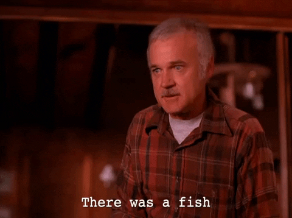

#  Fish in the Percolator
<p align="center">
  🐟 · ☕ · 📈
</p>


<p align="center">
  
</p>

*A simple Fisher forecasting demonstration using coffee cooling and [DerivKit](https://docs.derivkit.org/main/index.html).*

## Table of contents

* [Motivation](#motivation)
* [The model](#the-model)
* [Synthetic observations](#synthetic-observations)
* [Fisher forecasting](#fisher-forecasting)
* [Why derivatives?](#why-derivatives)
* [Why coffee?](#why-coffee)
* [Running the demo](#running-the-demo)
* [Interpreting the results](#interpreting-the-results)
  * [Cooling curve](#cooling-curve)
  * [Two-parameter forecast](#two-parameter-forecast)
  * [Triangle plot](#triangle-plot)
* [Beyond this toy model](#beyond-this-toy-model)
* [Repository structure](#repository-structure)
* [License and media credit](#license-and-media-credit)

---

## Motivation

Many scientific problems involve predicting how well model parameters could be constrained by noisy data.

Suppose we repeatedly measure the temperature of a cup of coffee as it cools.
Before fitting any particular data set, we may want to ask forecasting questions such as

* If the true initial coffee temperature is near a fiducial value, how accurately could we estimate it?
* If the true cooling time is near a fiducial value, how accurately could we estimate it?
* Which parameters would be most strongly correlated?
* How would the forecasted uncertainties change if we collected more measurements?
* How would the forecasted uncertainties change if the measurements were noisier or more precise?

Here, **fiducial** means the parameter values that we assume to be true when building the forecast.

These are exactly the kinds of questions addressed by **[Fisher forecasting](https://en.wikipedia.org/wiki/Fisher_information)**.

This repository provides a small demonstration of Fisher forecasting using **[Newton's law of cooling](https://en.wikipedia.org/wiki/Newton%27s_law_of_cooling)**, with forecasts computed using **DerivKit**.

Although the example is intentionally simple, the same workflow scales to much larger scientific models with many parameters.

---

## The model

We describe the temperature of the coffee using Newton's law of cooling

$$
T(t)=T_{\rm room}+\left(T_0-T_{\rm room}\right)e^{-t/\tau}
$$

where

* $T_0$ is the initial coffee temperature,
* $T_{\rm room}$ is the ambient room temperature,
* $\tau$ is the cooling time,
* $t$ is the elapsed time.

The temperature approaches the room temperature exponentially.

In the simplest example we forecast constraints on two parameters

$$
\theta=(T_0,\tau)
$$

while keeping the room temperature fixed.

Later we introduce additional nuisance parameters to illustrate larger Fisher forecasts and triangle plots.

---

## Synthetic observations

Instead of using real data, we generate synthetic measurements.

For a chosen fiducial parameter vector

$$
\theta_0
$$

we evaluate the cooling curve

$$
T(t;\theta_0)
$$

and add Gaussian measurement noise

$$
d_i=T(t_i;\theta_0)+\mathcal{N}(0,\sigma_T).
$$

This produces a mock experiment that illustrates what the data might look like.

The Fisher forecast then asks how precisely the parameters could be constrained for this experimental setup, assuming the true model is close to the fiducial model.

---

## Fisher forecasting

There are different ways to think about learning parameters from data.

In a **frequentist** approach, the model parameters are treated as fixed but unknown numbers, while the data are treated as random outcomes of a repeatable experiment.
If we could repeat the same coffee cooling experiment many times, each noisy data set would give slightly different best-fitting parameter estimates.

In a **Bayesian** approach, the observed data are fixed, and the parameters are treated as uncertain quantities that we want to infer.
The model tells us how likely the data are for a given set of parameters, and Bayes' theorem turns this around into a posterior distribution for the parameters.

Fisher forecasting is closely related to both viewpoints.
It does not fit one particular noisy data set.
Instead, it asks how much information an experiment is expected to contain about the parameters, assuming the true model is close to a chosen fiducial point.

Suppose our model predicts a data vector

$$
\mathbf{d}(\theta)
$$

for a parameter vector $\theta$.

The Fisher matrix is

$$
F_{ij} = \frac{\partial\mathbf{d}}{\partial\theta_i}^{\rm T} C^{-1} \frac{\partial\mathbf{d}}{\partial\theta_j}
$$

where

* $C$ is the data covariance matrix,
* $\partial\mathbf d/\partial\theta_i$ is the derivative of the model with respect to parameter $i$.

The Fisher matrix approximates the local curvature of the likelihood around the fiducial model.

A Fisher forecast does not by itself find the best-fitting parameter values.
_Instead, it predicts the expected parameter uncertainties near the fiducial point._

The corresponding forecasted parameter covariance is

$$
\Sigma=F^{-1}.
$$

From this covariance we obtain

* forecasted parameter uncertainties,
* parameter correlations,
* confidence ellipses,
* triangle plots.

For example, in the two-parameter coffee model,

$$
\theta=(T_0,\tau)
$$

the forecasted uncertainty on the initial temperature is

$$
\sigma(T_0)=\sqrt{\Sigma_{T_0T_0}}
$$

and the forecasted uncertainty on the cooling time is

$$
\sigma(\tau)=\sqrt{\Sigma_{\tau\tau}}.
$$

The correlation coefficient between the two parameters is

$$
\rho_{T_0,\tau} = \frac{\Sigma_{T_0\tau}} {\sqrt{\Sigma_{T_0T_0}\Sigma_{\tau\tau}}}.
$$

Values of $\rho$ close to zero indicate weak correlation between the two parameters.
Values of $|\rho|$ close to one indicate a strong degeneracy.

The sign of $\rho$ tells us the direction of the degeneracy:

* A positive value of $\rho$ means that the two parameters tend to increase or decrease together.
* A negative value of $\rho$ means that increasing one parameter can be compensated by decreasing the other.

---

## Why derivatives?

Computing the Fisher matrix requires derivatives of the model with respect to every parameter.

Derivatives describe how the predicted data change when a parameter is changed.
In the coffee example, they tell us how the cooling curve responds if we slightly change the initial temperature, the cooling time, or any other model parameter.

This is what makes derivatives useful for forecasting.
If changing a parameter produces a large change in the predicted data, that parameter can usually be constrained well.
If changing a parameter produces only a small change, or produces a change that looks very similar to another parameter, then the parameter will be harder to constrain or more strongly degenerate.

For this small toy model the derivatives could be derived analytically.

However, realistic scientific models often involve

* numerical simulations,
* differential equation solvers,
* Monte Carlo methods,
* external software,
* many parameters.

In these situations computing derivatives accurately and efficiently becomes one of the main challenges.

This is exactly the problem solved by **DerivKit**.

---

## Why coffee?

The coffee example is intentionally familiar.

Everyone understands that

* coffee starts hot,
* coffee cools,
* measurements contain noise.

This allows us to focus entirely on

* parameter uncertainties,
* parameter correlations,
* Fisher forecasting,

without introducing domain-specific knowledge.

Exactly the same workflow applies to

* cosmology,
* astronomy,
* climate science,
* biology,
* engineering,
* economics,

or any scientific model that predicts observables from parameters.

---

## Running the demo

Install

```bash
pip install -e .
```

Generate synthetic observations

```bash
percolator-data
```

Create the two-parameter Fisher forecast

```bash
percolator-two-param
```

Create the larger Fisher triangle plot

```bash
percolator-full
```

---

## Interpreting the results

### Cooling curve

The first figure shows

* noisy synthetic temperature measurements,
* the fiducial cooling model.

This represents the mock experiment.

---

### Two-parameter forecast

The second figure shows forecasted confidence ellipses for

* initial temperature,
* cooling time.

The ellipse illustrates

* forecasted parameter uncertainties,
* forecasted parameter correlations.

A narrow ellipse corresponds to well-constrained parameters.

A tilted ellipse indicates that increasing one parameter can be partially compensated by changing another.

The ellipse should be interpreted as the expected local constraint near the fiducial model, not as a direct fit to the particular noisy realization.

---

### Triangle plot

The final figure extends the model to additional parameters.

Each diagonal panel shows the marginalized forecast for one parameter.

Each off-diagonal panel shows the joint forecast for a pair of parameters.

Circular contours indicate nearly independent parameters.

Tilted ellipses indicate correlated parameters.

Long thin ellipses indicate strong parameter degeneracies.

---

## Beyond this toy model

This repository is intentionally small.

The purpose is not to build the most realistic model of coffee cooling.

Instead, it illustrates the complete Fisher forecasting workflow

```text
Model
        ↓
Fiducial parameters
        ↓
Synthetic observations
        ↓
Model derivatives
        ↓
Fisher matrix
        ↓
Forecasted covariance matrix
        ↓
Confidence contours
        ↓
Scientific interpretation
```

The exact same workflow is used in many areas of modern computational science, where DerivKit automates the derivative calculations that make Fisher forecasting possible.

---

## Repository structure

```text
src/
    model.py
        Coffee cooling models.

    data.py
        Synthetic data generation.

    fisher.py
        DerivKit Fisher utilities.

    plots.py
        Plotting helpers.

scripts/
    make_coffee_data.py
        Generates noisy observations.

    plot_two_param_forecast.py
        Produces a two-parameter Fisher forecast.

    plot_triangle_forecast.py
        Produces a larger Fisher triangle plot.
```

---

## License and media credit

Code and documentation in this repository are released under the MIT License.
See `LICENSE` for details.

Copyright © 2026 Niko Sarcevic.

The header GIF is from *Twin Peaks*, created by David Lynch and Mark Frost.
It is included as a media reference for this demonstration repository and is not covered by the repository software license.
All rights to *Twin Peaks* and related media remain with their respective copyright holders.
